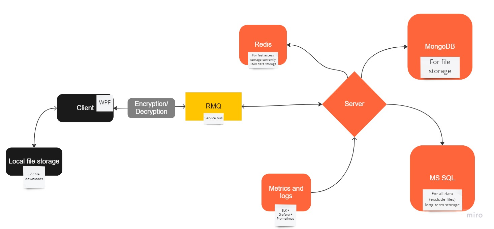

# Crypto Messenger with self-writed crypto primitives 
Just another pet project

## Architecture

## Contributors
[Valeriy Vartumyan - One and only](https://github.com/DeoEsor)

## Realizated ciphers algos

### Assymetric

* Benaloh
* ElGamal 
* RSA
* (will be updated soon)

### Symetric

* Rjindael
* Magenta
* DES
* (will be updated soon)

### Hash functions

* SHA-1 
* (will be updated soon)

### Cipher Modes

* CBC
* CFB
* CTR
* ECB 
* OFB
* RD
* RDH

## Tech stack

## Screenshots
